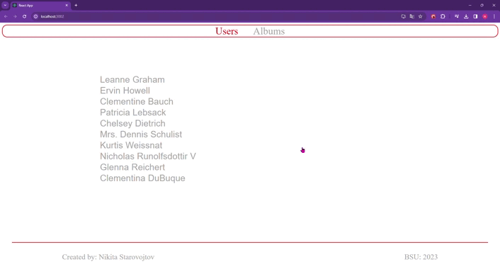

# Art Gallery.

## Description

Art gallery is an application containing information about authors and their albums.

The application has several pages containing information about all authors, detailed information about the author, a list of albums of all authors, and detailed information about the author's album

## Application functionality

  

The application is an online store with the ability to search, filter and sort
products.

The application generates a product database using the generateProduct() function

## Technologies used

- React
- React-router-dom
- Html
- Module Css
- Material UI

Jsonplaceholder is used as a fake database
